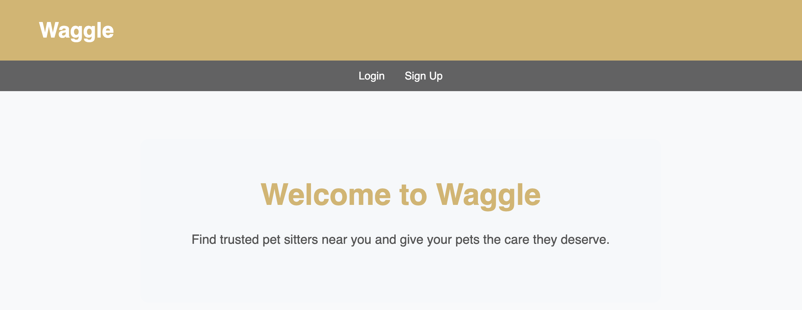

# WAGGLE

### IMAGE: Screenshot of a landing page for Waggle, welcoming you to Waggle.

## Background
Waggle is an app where pet owners can find sitters they trust to take care of their pets. As an owner of 5 pets and counting, finding someone I trust has always been important when it comes to the care of my fur children. 

## Getting Started
Signup and create your profile! Choose to be a pet owner, a pet sitter, or both! Add your pets, and find a sitter near you!

## Planning Materials
[Trello Board](https://trello.com/b/3TKpW5Hg/waggle)

[Deployed Website](https://waggle-36cf264a7f94.herokuapp.com/)

## Attributes
A lot of the credit goes to Django Forums for assistance with a deeper understanding of what I was doing, and why. 

*__Building Resources__: [Django Forum](https://forum.djangoproject.com/t/how-to-create-custom-users-with-different-roles-types/20772) [Stack Overflow](https://stackoverflow.com/questions/9046533/creating-user-profile-pages-in-django)

*__CSS Styling__: [CSS Grid Layout Guide](https://css-tricks.com/snippets/css/complete-guide-grid/), [CSS Tools](https://www.cssportal.com/css-tools.php), ChatGPT

*__Technologies Used__: Python, Django, PostgreSql, HTML, CSS, VS Code, Pipenv, Github, Heroku

*__ChatGPT__: Assisted with some of explaining errors that I was receiving. Also used to help debug when my poor eyes couldn't see the small commas etc that were messing with my code.

*__Planned Future Enhancements__: Pay for your booking in the app! BG checks for pet sitters and owners! Reviews!

